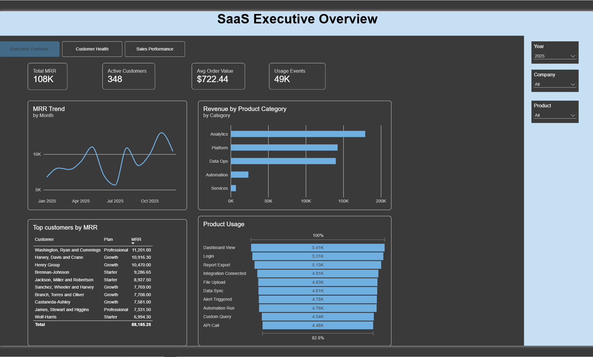
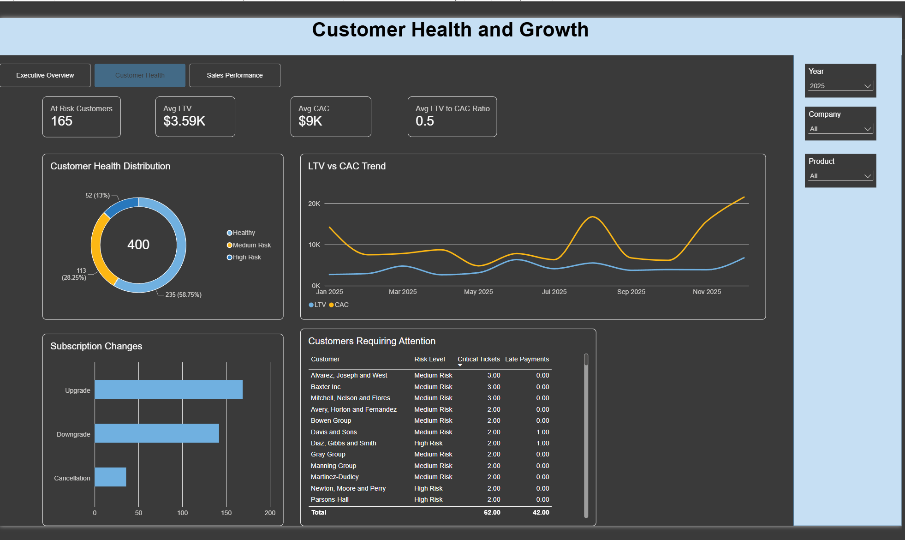
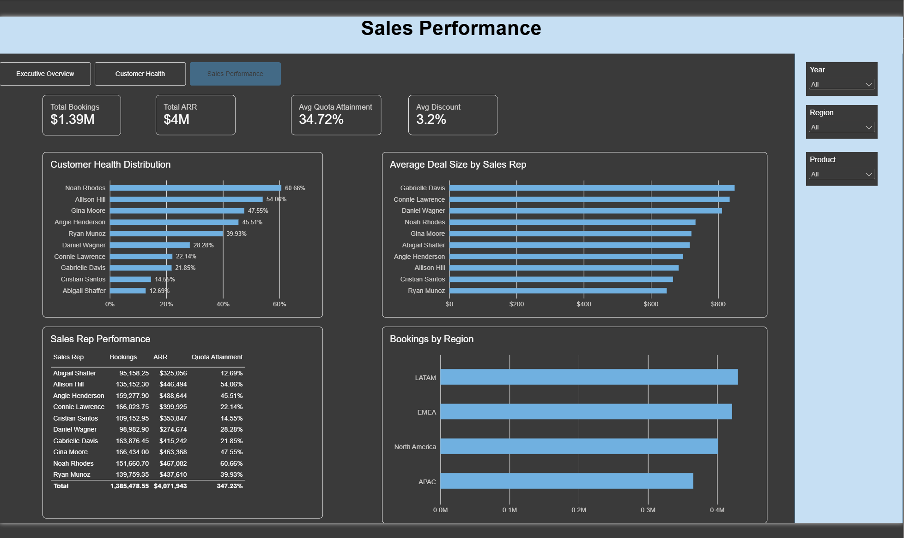

# SaaS Sales & Usage Analytics Pipeline

An end-to-end analytics engineering portfolio project that transforms raw SaaS business data into analytics-ready models using **Snowflake and dbt**, then surfaces business insights through an interactive **Power BI dashboard**.

## Project Overview

This project simulates the analytics environment of a SaaS company with data spanning sales, customers, product usage, subscriptions, payments, support, marketing, and employees.

The goal was to build a complete analytics workflow:

**Raw CSV Data → Snowflake → dbt → Analytics Marts → Power BI**

The project demonstrates data modeling, transformation, testing, documentation, historical tracking, and business intelligence reporting.

## Tech Stack

- **Snowflake** — cloud data warehouse
- **dbt Core** — transformation, testing, documentation, and lineage
- **SQL** — data modeling and business logic
- **Power BI** — semantic modeling, DAX, and dashboard development
- **Git / GitHub** — version control and project documentation

## Data Sources

The project contains nine source datasets:

- Customers
- Products
- Sales Orders
- Usage Events
- Employees
- Subscription Changes
- Marketing Spend
- Support Tickets
- Payments

Raw CSV files are loaded into the `RAW` schema in Snowflake before being transformed by dbt.

## Data Architecture

```text
Raw CSV Files
      │
      ▼
Snowflake RAW
      │
      ▼
dbt Staging Models
      │
      ▼
dbt Intermediate Models
      │
      ▼
Analytics Marts
      │
      ▼
Power BI
```

The dbt project follows a layered modeling approach:

### Staging

Staging models provide clean interfaces to the raw Snowflake tables.

Examples:

- `stg_customers`
- `stg_products`
- `stg_sales_orders`
- `stg_usage_events`
- `stg_payments`
- `stg_support_tickets`

### Intermediate

Intermediate models contain reusable business logic, including:

- Order-level MRR and ARR calculations
- Customer usage aggregation

### Marts

The mart layer provides analytics-ready datasets including:

- Customer dimension
- Product dimension
- Employee dimension
- Sales orders fact
- Usage events fact
- Payments fact
- Support tickets fact
- Subscription changes fact
- Monthly MRR
- Customer health
- Sales representative performance
- CAC and LTV analysis

## Data Quality

The dbt project includes automated data quality tests for areas such as:

- Primary-key uniqueness
- Required/non-null fields
- Accepted values
- Referential integrity between models

The final dbt test suite contains **35 tests**.

## Historical Tracking

A dbt snapshot tracks changes to customer:

- Plan tier
- Account status

This implements **Slowly Changing Dimension Type 2 (SCD Type 2)** behavior, allowing historical customer states to be preserved instead of overwritten.

## Power BI Dashboard

The final Power BI report contains three analytical pages.

### Executive Overview

Provides a high-level view of SaaS business performance, including MRR, active customers, average order value, product usage, customer performance, and revenue trends.



### Customer Health & Growth

Analyzes customer risk and SaaS unit economics using customer health classifications, support activity, late payments, subscription changes, CAC, and LTV.



### Sales Performance

Evaluates sales organization performance using bookings, ARR, quota attainment, discounts, average deal size, and regional performance.



## Key Business Questions

The analytical models and dashboards are designed to answer questions such as:

- How is recurring revenue trending?
- Which products and customers are driving revenue?
- Which customers show signs of churn risk?
- How do CAC and LTV compare over time?
- What subscription changes are occurring?
- Which sales representatives are meeting quota?
- Which representatives are closing the largest deals?
- Which regions generate the most bookings?

## Repository Structure

```text
SaaS-Analytics/
│
├── dbt/
│   ├── models/
│   │   ├── staging/
│   │   ├── intermediate/
│   │   └── marts/
│   ├── snapshots/
│   └── dbt_project.yml
│
├── powerbi/
│   └── SaaS_Analytics_Dashboard.pbix
│
├── images/
│   ├── executive_overview.png
│   ├── customer_health_growth.png
│   └── sales_performance.png
│
├── .gitignore
└── README.md
```

## Skills Demonstrated

This project demonstrates practical experience with:

- Dimensional data modeling
- Analytics engineering
- Snowflake
- dbt
- SQL transformations
- Fact and dimension modeling
- MRR and ARR calculations
- CAC and LTV analysis
- Customer health modeling
- SCD Type 2 snapshots
- Automated data testing
- Data lineage and documentation
- Power BI data modeling
- DAX
- Dashboard design
- Git version control

## Dashboard

The Power BI `.pbix` file is available in the [`powerbi`](powerbi/) directory.