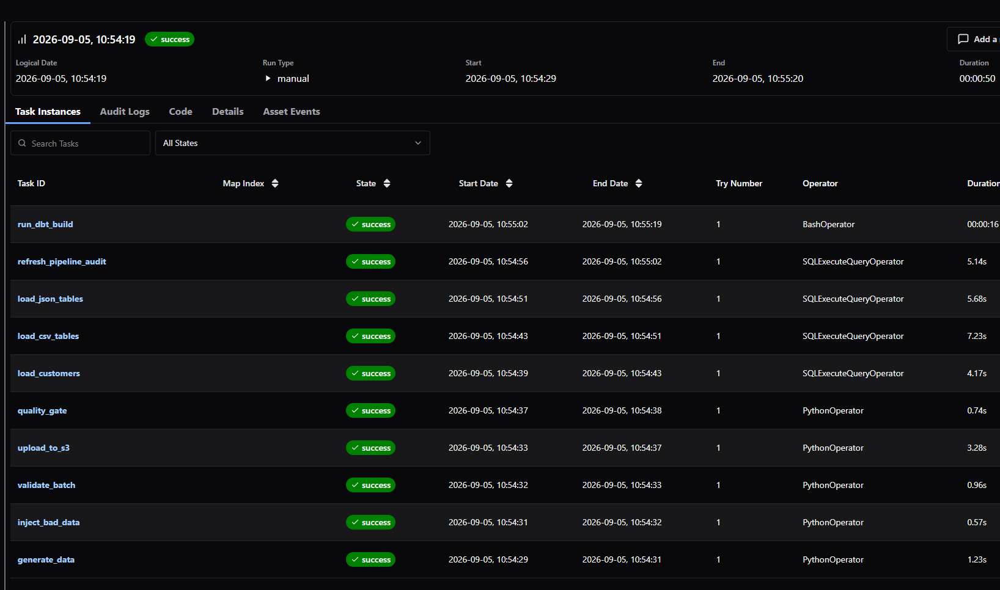
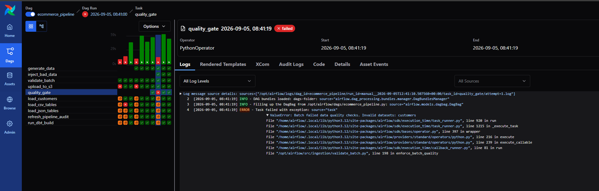
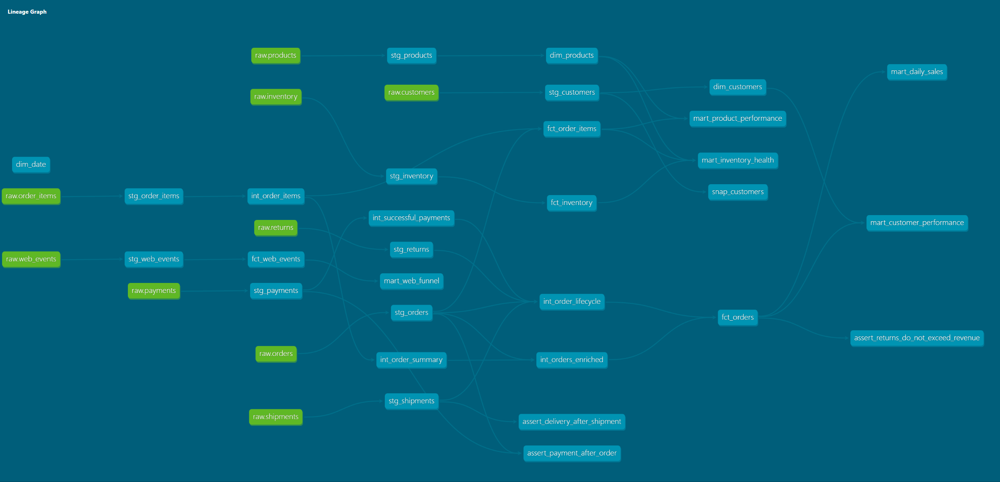
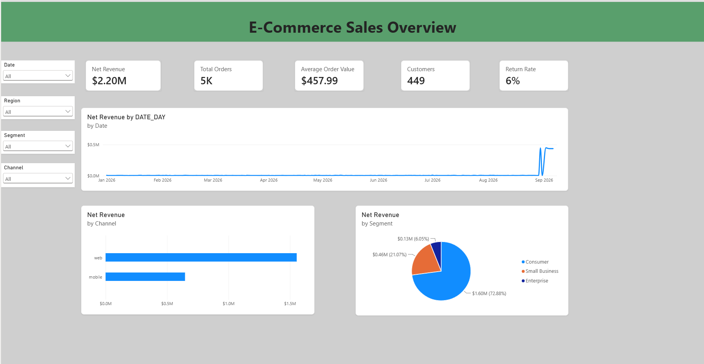
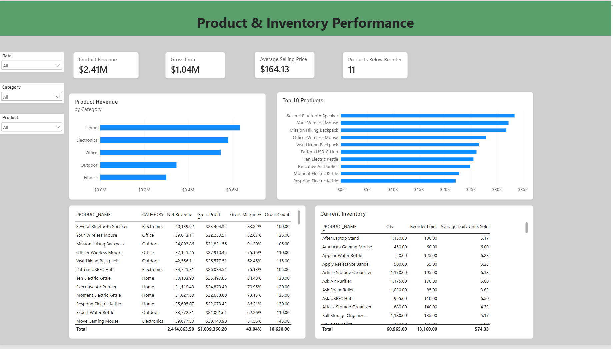
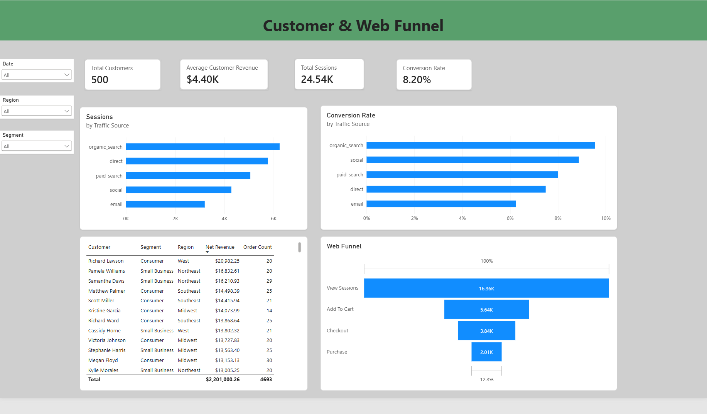

# Northstar Commerce Data Platform

An end-to-end **data engineering and analytics engineering platform** that simulates a modern e-commerce data environment.

The project builds a complete pipeline from source-data generation through cloud ingestion, warehouse transformation, orchestration, data quality enforcement, dimensional modeling, and business intelligence reporting.

The goal was to build a portfolio project that goes beyond creating dashboards and demonstrates how a production-style analytics platform can be designed, automated, tested, and monitored.

---

## Architecture

```text
Python Data Generators
        |
        v
Validation + Manifest Creation
        |
        v
AWS S3
   |          |
   |          +----> Quarantine
   |                 (invalid data)
   v
Snowflake RAW
        |
        v
dbt
        |
        +----> Staging
        |
        +----> Intermediate
        |
        +----> Dimensions / Facts
        |
        +----> Analytics Marts
        |
        v
Power BI
```

**Apache Airflow orchestrates the complete workflow**, including generation, validation, S3 ingestion, Snowflake loading, audit updates, and dbt execution.

---

## Technology Stack

| Technology | Purpose |
|---|---|
| Python | Synthetic source generation, validation, manifests, ingestion |
| AWS S3 | Cloud raw-data landing zone and quarantine storage |
| Snowflake | Cloud data warehouse |
| Apache Airflow | Pipeline orchestration and dependency management |
| dbt | SQL transformation, testing, dimensional modeling, lineage |
| Power BI | Semantic modeling, DAX, dashboards, business analytics |
| Docker | Containerized Airflow environment |
| pytest | Python unit testing |
| Git / GitHub | Version control and project documentation |

---

## Pipeline Workflow

The Airflow pipeline executes the following workflow:

1. Generate synthetic e-commerce source data
2. Optionally inject invalid data for pipeline testing
3. Validate the generated batch
4. Create a batch manifest with file metadata and checksums
5. Upload valid and invalid datasets to the appropriate S3 locations
6. Enforce a data-quality gate
7. Load CSV datasets into Snowflake
8. Load JSON datasets into Snowflake
9. Refresh pipeline audit metadata
10. Execute the dbt transformation and testing workflow

### Successful Airflow Run



The pipeline coordinates Python, AWS S3, Snowflake, and dbt as a single automated workflow.

---

## Source Data

The platform simulates nine e-commerce datasets:

| Dataset | Description |
|---|---|
| Customers | Customer master data |
| Products | Product catalog and pricing |
| Orders | Order-level transactions |
| Order Items | Individual products belonging to orders |
| Payments | Payment attempts and payment status |
| Shipments | Shipping and delivery lifecycle |
| Returns | Returned orders and refund information |
| Inventory | Product inventory snapshots |
| Web Events | Customer web behavior and traffic activity |

The generators maintain relationships between datasets so that downstream transformations can model realistic business processes.

---

## Data Lake & Idempotent Ingestion

Generated batches are uploaded to AWS S3 using date-partitioned paths.

Example:

```text
raw/
    customers/
        run_date=YYYY-MM-DD/
            customers.csv

    orders/
        run_date=YYYY-MM-DD/
            orders.json
```

Each file receives a SHA-256 checksum.

Before uploading a file, the ingestion process checks the existing S3 object's checksum.

This allows the pipeline to:

- Upload new files
- Skip files that have already been loaded unchanged
- Detect unexpected changes to an existing batch
- Safely rerun pipeline executions

This provides **idempotent ingestion**, an important requirement for reliable data pipelines.

---

## Data Quality & Quarantine

The pipeline validates incoming datasets before allowing them into the warehouse transformation workflow.

Validation includes checks such as:

- Required columns
- Required identifiers
- Null values in required fields
- Empty datasets
- Expected file structure

Invalid datasets are routed to a separate S3 quarantine area rather than being loaded into Snowflake.

```text
quarantine/
    customers/
        run_date=YYYY-MM-DD/
            customers.csv
```

A pipeline quality gate prevents downstream warehouse processing when an invalid dataset is detected.

### Controlled Failure Test

The project includes an optional bad-data injection step used to deliberately corrupt a dataset and verify the failure path.



In this test, an invalid customer record was intentionally generated. The dataset was quarantined and the Airflow quality gate stopped the pipeline before Snowflake and dbt processing could continue.

This demonstrates that the pipeline handles both the **success path and failure path** rather than assuming all incoming data is valid.

---

## Snowflake Data Warehouse

Snowflake provides the central warehouse for the platform.

The database is separated into logical layers:

```text
ECOMMERCE_DATA_PLATFORM
│
├── RAW
├── AUDIT
├── STAGING
├── INTERMEDIATE
└── MARTS
```

### RAW

Stores source data loaded from S3 with ingestion metadata such as:

- Source file
- Load timestamp

### AUDIT

Tracks pipeline ingestion information including:

- Run date
- Dataset
- S3 key
- Validation status
- Load status
- Records loaded
- Error information
- Load completion time

A batch-health view summarizes whether all expected datasets completed successfully.

### STAGING / INTERMEDIATE / MARTS

These schemas support the dbt transformation architecture.

---

## dbt Analytics Engineering

dbt transforms the raw Snowflake datasets into tested analytics models.

The project follows a layered transformation architecture:

```text
Sources
   ↓
Staging
   ↓
Intermediate
   ↓
Dimensions / Facts
   ↓
Business Marts
```

### Staging

Staging models standardize raw source data and provide clean interfaces for downstream transformations.

Examples:

```text
stg_customers
stg_products
stg_orders
stg_order_items
stg_payments
stg_shipments
stg_returns
stg_inventory
stg_web_events
```

### Intermediate Models

Intermediate models contain reusable business logic such as:

```text
int_order_items
int_order_summary
int_orders_enriched
int_order_lifecycle
int_successful_payments
```

### Dimensional Models

The analytics layer contains dimensions and facts including:

```text
dim_customers
dim_products
dim_date

fct_orders
fct_order_items
fct_inventory
fct_web_events
```

### Business Marts

Business-facing marts provide simplified datasets for reporting:

```text
mart_daily_sales
mart_product_performance
mart_inventory_health
mart_customer_performance
mart_web_funnel
```

---

## dbt Lineage

The dbt lineage graph documents dependencies between raw sources, staging models, intermediate transformations, facts, dimensions, marts, and data-quality assertions.



This lineage makes it possible to trace business metrics back through their transformations to the original source datasets.

---

## Testing

The project uses multiple layers of testing.

### Python Tests

pytest is used to test components such as:

- Source-data generation
- Validation logic
- Manifest creation
- S3 ingestion behavior

### dbt Tests

dbt tests validate warehouse transformations and relationships.

The project also includes business-rule assertions such as:

```text
Payment must occur after the order
Delivery must occur after shipment
Returns cannot exceed recognized revenue
```

These tests help detect logically invalid data that basic null and uniqueness checks would not catch.

---

## Incremental Processing

Large fact models use dbt incremental materializations rather than rebuilding the entire table on every pipeline execution.

Examples include:

```text
fct_orders
fct_order_items
fct_inventory
fct_web_events
```

This models the way production analytics systems process growing datasets efficiently.

---

## Historical Backfills

The pipeline accepts a configurable `run_date`.

This allows Airflow to process historical business dates using the same workflow as a normal daily run.

For example:

```text
run_date = 2026-08-30
```

The ability to rerun historical partitions provides a controlled mechanism for backfills and reprocessing.

---

# Power BI Analytics

The final Snowflake marts feed a Power BI semantic model and three business-facing report pages.

## E-Commerce Sales Overview

Provides executive-level sales KPIs including:

- Net Revenue
- Total Orders
- Average Order Value
- Customer Count
- Return Rate
- Revenue by Channel
- Revenue by Customer Segment
- Revenue Trends



---

## Product & Inventory Performance

Combines product sales performance with inventory information.

Key metrics include:

- Product Revenue
- Gross Profit
- Gross Margin
- Average Selling Price
- Products Below Reorder Point
- Product Revenue by Category
- Top Performing Products
- Current Inventory



---

## Customer & Web Funnel

Combines customer-level analytics with web-session behavior.

Key metrics include:

- Total Customers
- Average Customer Revenue
- Total Web Sessions
- Conversion Rate
- Sessions by Traffic Source
- Conversion Rate by Traffic Source
- Customer Lifetime Revenue
- Web Conversion Funnel

The funnel tracks:

```text
View
  ↓
Add to Cart
  ↓
Checkout
  ↓
Purchase
```



---

# Reliability Features

A major focus of the project was building reliability into the pipeline rather than only moving data from one system to another.

The platform includes:

- Deterministic synthetic data generation
- Date-partitioned batch processing
- SHA-256 file checksums
- Idempotent S3 ingestion
- Batch manifests
- Data validation
- S3 quarantine workflows
- Airflow quality gates
- Snowflake pipeline auditing
- dbt data tests
- Business-rule assertions
- Incremental fact models
- Historical backfill support

---

# Repository Structure

```text
ecommerce-data-platform/
│
├── airflow/
│   └── dags/
│
├── dbt/
│   └── ecommerce_analytics/
│
├── images/
│
├── powerbi/
│
├── sql/
│   ├── snowflake_setup/
│   ├── raw_tables/
│   └── audit_tables/
│
├── src/
│   ├── common/
│   ├── generator/
│   └── ingestion/
│
├── tests/
│   ├── unit/
│   └── integration/
│
├── docker-compose.yml
├── Dockerfile
├── requirements.txt
└── README.md
```

---

# Key Engineering Decisions

### Batch-first architecture

The platform uses daily batch ingestion rather than introducing streaming infrastructure where it is not necessary.

### Immutable raw storage

S3 acts as the raw landing zone so source batches can be retained independently from warehouse transformations.

### Validation before warehouse processing

Invalid source data is quarantined before it can contaminate downstream analytics models.

### Layered dbt architecture

Transformation logic is separated into staging, intermediate, fact/dimension, and business-mart layers instead of placing business logic directly inside BI reports.

### Idempotency

Checksum-based ingestion allows the same batch to be rerun safely without silently creating duplicate source files.

### Separate orchestration and warehouse auditing

Airflow records orchestration state while Snowflake maintains warehouse ingestion metadata, providing visibility into both pipeline execution and actual warehouse loads.

---

# Skills Demonstrated

This project demonstrates practical experience with:

**Data Engineering**

- Python pipeline development
- AWS S3
- Cloud ingestion
- File partitioning
- Checksums and idempotency
- Data validation
- Quarantine workflows
- Apache Airflow
- Docker
- Snowflake ingestion
- Pipeline auditing
- Backfills

**Analytics Engineering**

- dbt
- SQL transformations
- Dimensional modeling
- Fact and dimension design
- Incremental models
- Data testing
- Business-rule testing
- Lineage
- Analytics marts

**Business Intelligence**

- Power BI
- Semantic modeling
- DAX
- KPI design
- Sales analytics
- Product analytics
- Inventory analytics
- Customer analytics
- Web funnel analytics

---

## Production Considerations

This project is designed as a local/cloud portfolio implementation.

For a production deployment, additional improvements would include:

- Dedicated least-privilege Snowflake service roles
- Managed AWS credential handling instead of local development credentials
- Centralized secrets management
- Production Airflow infrastructure
- Automated deployment environments
- Alerting and notification integrations
- Expanded monitoring and SLA management

These were intentionally kept outside the scope of the portfolio implementation while the core pipeline architecture was built to demonstrate the underlying engineering patterns.

---

## Project Outcome

Northstar Commerce demonstrates the complete lifecycle of an analytics platform:

**source generation → validation → cloud storage → warehouse ingestion → transformation → testing → analytics → visualization**

Rather than focusing only on a dashboard or individual SQL models, the project demonstrates how data engineering and analytics engineering components work together to create a reliable, traceable, and business-ready data platform.